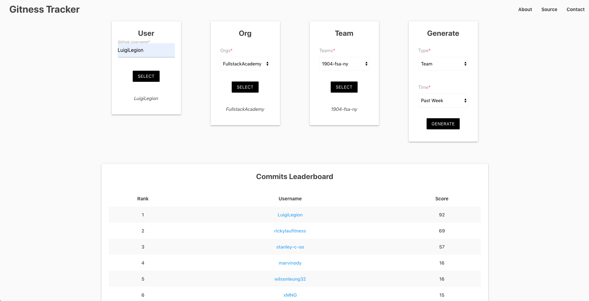

# Gitness Tracker

## Video Presentation

Coming soon...

## Deployed Web App

<https://gitness-tracker.web.app>

## Description

Responsive web app that helps open source project maintainers hold friendly code contribution competitions by allowing them to determine who contributed the most code over a given period of time by total number of public commits. Contributions are pulled from GitHub using their GraphQL API and presented in the form of an organization, team, or user leaderboard.

MVP completed in 4 days for a solo project.

## Tech Stack

Built using React, Redux, and Materialize.css, and utilizes the GitHub GraphQL API.

## Dev Team

- Tal Luigi ([LinkedIn](https://www.linkedin.com/in/tal-luigi) | [GitHub](https://github.com/luigilegion))
